# Static Routing using SDN Controller (Ryu + Mininet)

## 📌 Project Overview
This project demonstrates **Static Routing using Software Defined Networking (SDN)** with the **Ryu Controller** and **Mininet emulator**.

The controller installs flow rules in switches to enable communication between hosts in a predefined topology.

---

## 🎯 Problem Statement
Traditional networks use distributed control logic, making routing complex and less flexible.  
This project implements **static routing using a centralized SDN controller**, where:

- The controller manages packet forwarding decisions
- Flow rules are installed dynamically in switches
- Hosts communicate through SDN-controlled paths

---

## 🛠️ Technologies Used
- Python 3
- Ryu SDN Controller
- Mininet Network Emulator
- Open vSwitch (OVS)
- OpenFlow Protocol (v1.3)

---

## ⚙️ Setup & Execution Steps

### 🔹 Step 1: Install Dependencies
```bash
sudo apt update
sudo apt install mininet openvswitch-switch python3-pip python3.10-venv -y
```

### 🔹 Step 2: Create Virtual Environment
```bash
python3 -m venv ryu-env
source ryu-env/bin/activate
```

### 🔹 Step 3: Install Ryu and Dependencies
```bash
pip install ryu==4.34
pip install eventlet==0.30.2
pip install dnspython==1.16.0
```

### 🔹 Step 4: Start Ryu Controller (Terminal 1)
```bash
cd ~
source ryu-env/bin/activate
export EVENTLET_NO_GREENDNS=yes
ryu-manager ryu.app.simple_switch_13
```

### 🔹 Step 5: Run Mininet Topology (Terminal 2)
```bash
sudo mn --topo linear,2 --controller remote
```

### 🔹 Step 6: Test Connectivity (Mininet CLI)
```bash
pingall
```

Expected Output:
```
0% packet loss
```

### 🔹 Step 7: Exit Mininet
```bash
exit
```

### 🔹 Step 8: Check Flow Rules
```bash
sudo ovs-ofctl -O OpenFlow13 dump-flows s1
sudo ovs-ofctl -O OpenFlow13 dump-flows s2
```

### 🔹 Step 9: Regression Test

Delete flows:
```bash
sudo ovs-ofctl del-flows s1
sudo ovs-ofctl del-flows s2
```

### 🔹 Step 9: User Based Menu for Functionalities

```bash
python3 sdn_demo_ui.py
```

Expected Output:
```
0% packet loss
```

EXPECTED OUTPUT SCREENSHOTS
## 📸 Controller Running
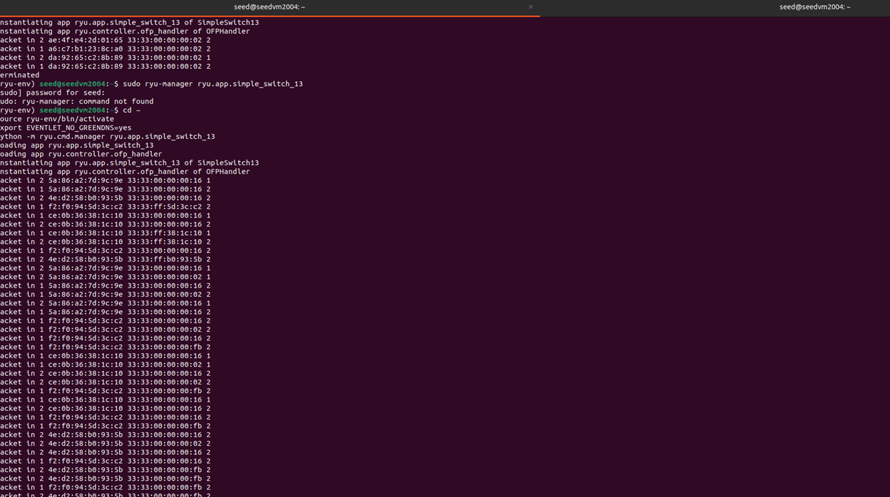
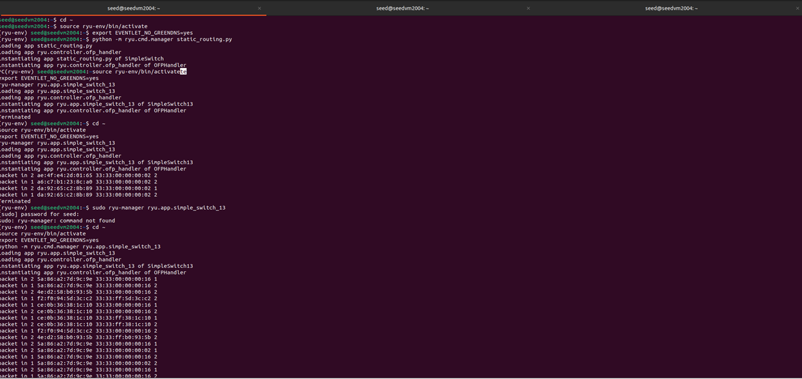
## 📸 Mininet Topology
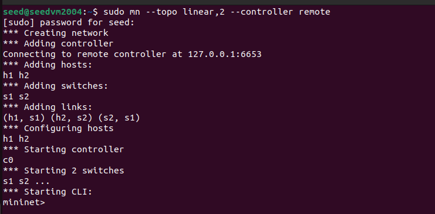
## 📸 Ping Success
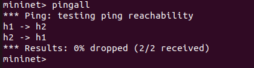
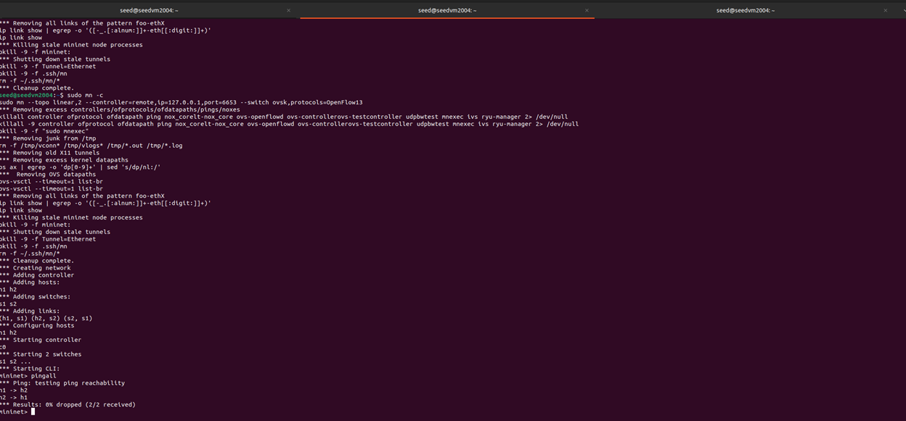
## 📸 Mininet Statistics
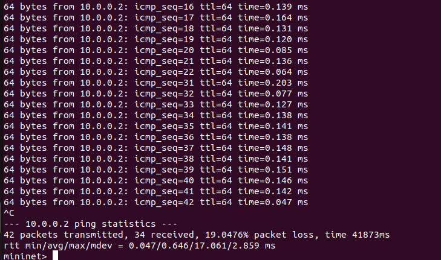
## 📸 Choice 2 In User Based Menu
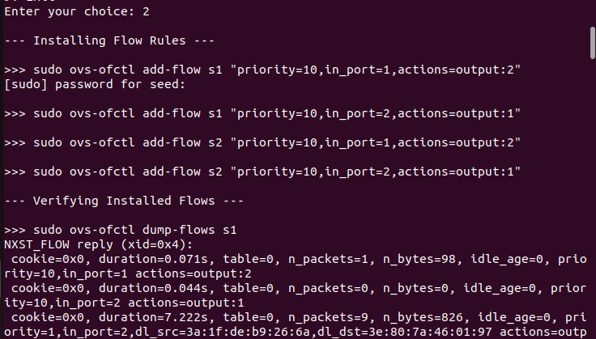
## 📸 Choice 3 In User Based Menu
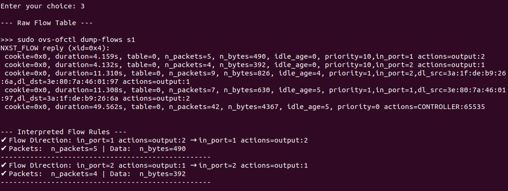
## 📸 Choice 5 In User Based Menu
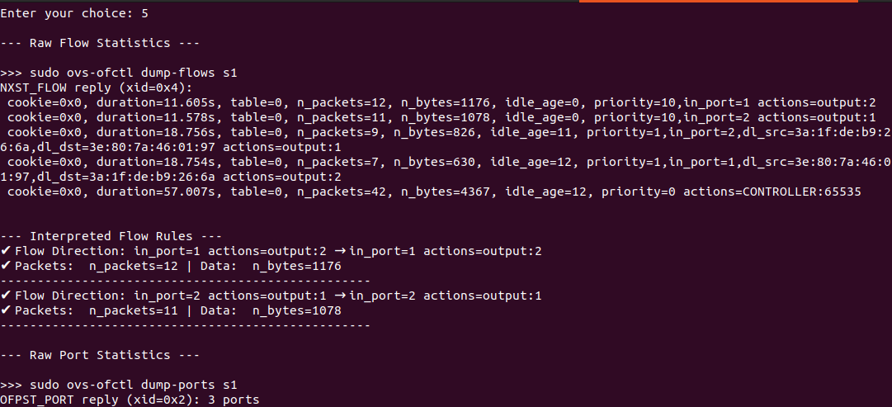
## 📸 Choice 6 In User Based Menu
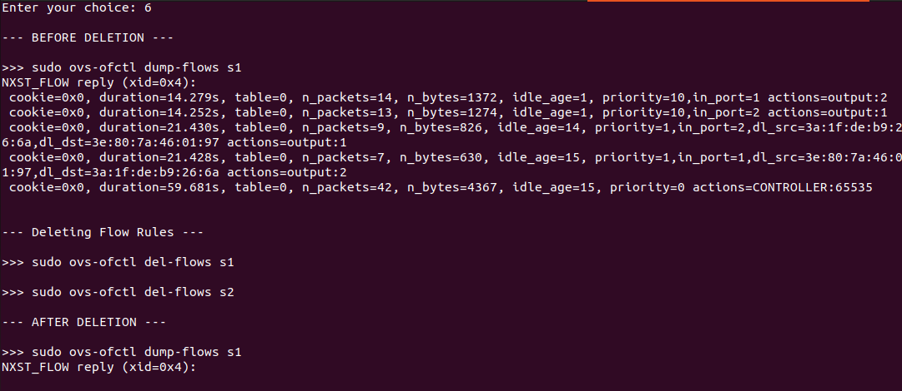
## 📸 Choice 7 In User Based Menu
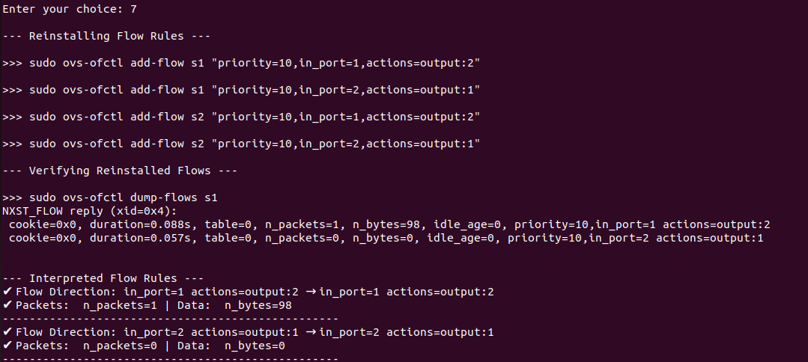
## 📸 Flow Table - s1
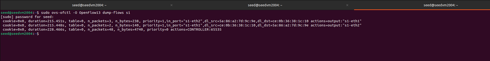
## 📸 Flow Table - s2
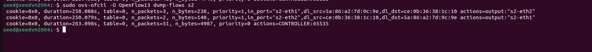
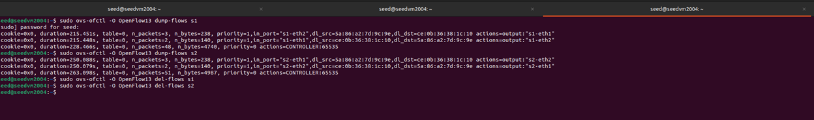


## 📚 References

1. Ryu SDN Framework Documentation  
   https://ryu.readthedocs.io/

2. Mininet Official Documentation  
   http://mininet.org/documentation/

3. Open vSwitch Documentation  
   https://docs.openvswitch.org/

4. OpenFlow Switch Specification (Version 1.3.0)  
   https://opennetworking.org/wp-content/uploads/2014/10/openflow-spec-v1.3.0.pdf

5. Ryu Simple Switch Example  
   https://github.com/faucetsdn/ryu/blob/master/ryu/app/simple_switch_13.py

6. Ubuntu Documentation (Package Installation & Networking)  
   https://help.ubuntu.com/

7. Eventlet Documentation  
   https://eventlet.readthedocs.io/

8. GitHub Documentation (README formatting)  
   https://docs.github.com/en/get-started/writing-on-github

  
